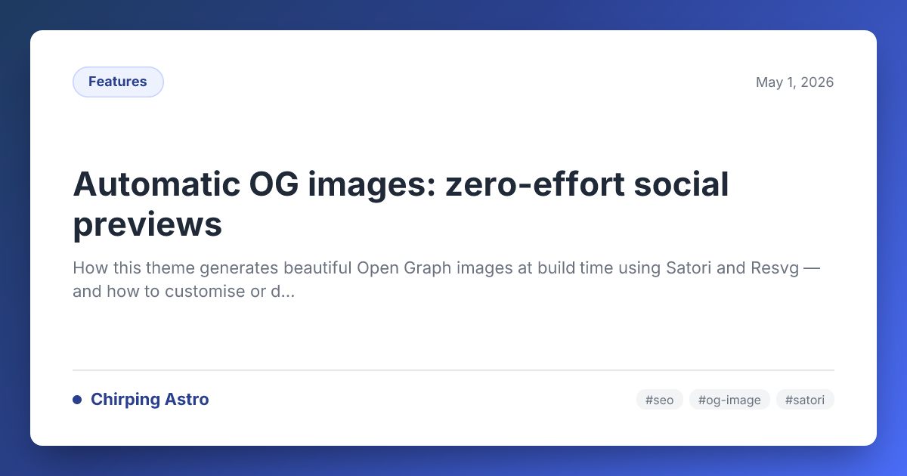

Quand vous partagez un lien de blog sur Twitter, Discord, Slack ou
LinkedIn, la plateforme récupère une **image Open Graph** pour afficher
un aperçu visuel. Sans image, votre lien ressemble à un simple extrait
de texte — facile à ignorer en scrollant.

Ce thème **génère automatiquement** un PNG stylé de 1200×630 pour chaque
article qui n'a pas de `heroImage` définie. Aucun outil de design,
aucun travail manuel — écrivez simplement votre article et l'image OG
apparaît.

## Comment ça fonctionne

Au moment du build, le thème :

1. Parcourt chaque article dans chaque langue.
2. Pour les articles **sans** `heroImage`, génère un PNG à
   `/og/<slug>.png` (ou `/og/<locale>/<slug>.png` pour les langues
   secondaires).
3. Associe le chemin généré aux balises `<meta property="og:image">`
   et `<meta name="twitter:image">` automatiquement.

Les articles **avec** une `heroImage` continuent d'utiliser cette image
comme aperçu OG — l'image générée est un repli, pas un remplacement.

### Sous le capot

- **[Satori](https://github.com/vercel/satori)** convertit un arbre
  d'éléments React-like en SVG. Il supporte la mise en page flexbox,
  les polices, les dégradés et les border-radius.
- **[@resvg/resvg-js](https://github.com/nickmccurdy/resvg-js)** rend
  le SVG en PNG haute qualité aux dimensions exactes.
- **[@fontsource/inter](https://fontsource.org/fonts/inter)** fournit
  la police Inter localement (regular + bold), donc aucune requête
  réseau pendant le build.

Le pipeline entier s'exécute côté serveur au moment du build. **Aucun
JavaScript ni requête externe n'est ajouté à votre site déployé.**

## Le design généré

Chaque image OG présente :

- Un **dégradé bleu indigo profond** en bordure (correspondant à la
  couleur primaire du thème).
- Une **carte blanche** avec des coins arrondis et une ombre subtile.
- **Badge de catégorie** (en haut à gauche) dans le style pilule indigo.
- **Date de publication** (en haut à droite).
- **Titre de l'article** en gras, avec une taille de police adaptative.
- **Extrait de description** sous le titre (tronqué à ~120 caractères).
- **Marque du site** (en bas à gauche) — le nom du site avec un point
  de couleur.
- **Tags** (en bas à droite) — jusqu'à 3 tags en badges pilules.

Voici l'image OG qui a été automatiquement générée pour **cet article même** :



## Activer / désactiver

La fonctionnalité est contrôlée par un seul paramètre dans
`src/config.ts` :

```ts title="src/config.ts"
export const SITE: SiteConfig = {
  // ...
  autoOgImage: true, // Mettre à false pour désactiver
};
```

Quand **activé** (par défaut) :

- Un PNG est généré pour chaque article au moment du build.
- Les articles sans `heroImage` utilisent l'image OG générée.
- Les articles avec `heroImage` continuent d'utiliser leur hero.

Quand **désactivé** :

- Aucune image OG n'est générée (la route `/og/` ne produit aucune page).
- Les articles sans `heroImage` utilisent `SITE.defaultOgImage`
  (typiquement via `SITE.defaultOgImage`).

## Personnaliser le design

Le template d'image OG se trouve dans `src/utils/og-image.ts`. Il
exporte une seule fonction :

```ts
export async function generateOgImage(data: OgImageData): Promise<Buffer>;
```

L'interface `OgImageData` :

```ts
interface OgImageData {
  title: string;
  description?: string;
  date?: string;
  category?: string;
  tags?: string[];
}
```

### Changer les couleurs

Le template utilise des couleurs hex codées en dur correspondant au
thème Chirpy :

| Élément             | Couleur actuelle      | Où modifier            |
| ------------------- | --------------------- | ---------------------- |
| Fond dégradé        | `#1e3a5f` → `#4a6cf7` | Propriété `background` |
| Fond de carte       | `#ffffff`             | `backgroundColor`      |
| Badge catégorie     | `#2a408e`             | Plusieurs objets style |
| Texte titre         | `#1f2937`             | `color` du titre       |
| Texte description   | `#6b7280`             | `color` description    |
| Point accent marque | `#2a408e`             | Style du point         |

### Changer la police

Le template utilise **Inter** (400 + 700) chargée depuis
`@fontsource/inter`. Pour utiliser une autre police :

1. Installer le package : `bun add @fontsource/votre-police`
2. Mettre à jour les chemins dans `src/utils/og-image.ts`
3. Mettre à jour le nom de police dans les options `satori()`

### Changer la mise en page

Satori utilise un **moteur de mise en page flexbox uniquement**.
Chaque élément doit avoir `display: 'flex'` s'il a plus d'un enfant.

Satori supporte : flexbox, `border-radius`, `padding`, `margin`,
`background` (y compris `linear-gradient`), `box-shadow`,
`font-size`, `font-weight`, `color`, `line-height`, `border`.

Il ne supporte **pas** : CSS Grid, `position: absolute/relative`,
`transform`, animations, pseudo-éléments, ou media queries.

## Le hero remplace l'OG par article

Si un article a une `heroImage` en frontmatter, cette image est
utilisée pour la balise meta OG — l'image auto-générée n'est pas
utilisée :

```yaml
---
title: Mon article avec un OG personnalisé
heroImage: ../../../assets/images/posts/automatic-og-images/mon-og-custom.png
---
```

## Notes de performance

- **Temps de build :** Chaque image prend ~50–100ms à générer.
- **Taille de fichier :** Les PNG générés font typiquement 100–115 Ko.
- **Aucun coût runtime :** Les images sont des fichiers statiques.
- **Chargement des polices :** Depuis le disque, aucune requête réseau.

## Dépannage

| Symptôme                                                   | Solution                                                                                       |
| ---------------------------------------------------------- | ---------------------------------------------------------------------------------------------- |
| L'image OG n'apparaît pas sur les réseaux sociaux          | Vérifiez que l'URL de l'image est accessible. Utilisez [opengraph.xyz](https://opengraph.xyz). |
| Le build échoue avec une erreur Satori sur `display: flex` | Assurez-vous que chaque `div` avec plusieurs enfants a `display: 'flex'`.                      |
| Les polices ont l'air erronées                             | Confirmez que les fichiers `.woff` existent au chemin indiqué dans `og-image.ts`.              |
| Désactiver pour la performance                             | Mettez `autoOgImage: false` dans `src/config.ts`.                                              |
